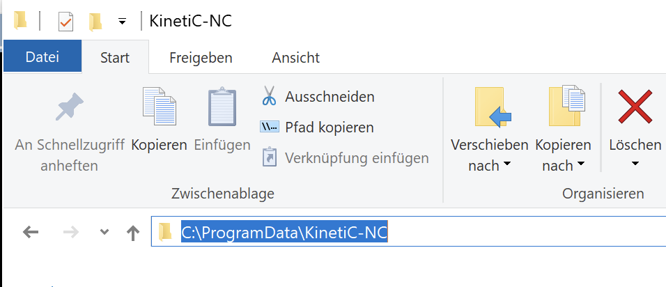

# FUSION  to KINETIC-NC tool library converter

Python script to automate the transfer of tools which were generated in [Autodesk Fusion](https://www.autodesk.com/products/fusion-360) to be used in the [KINETIC-NC](https://www.cnc-step.de/cnc-software/kinetic-nc-netzwerk-steuerungssoftware/) CNC control software from CNC Step (https://www.cnc-step.de).

# Usage

 - Export tool library from FUSION. Use the JSON export format.
 - Run the script on that file using the Python interpreter:
```
 python FUSION_to_KINETIC-NC_TOOL_CONVERTER.py my_tool_library.json
```

 - A file named **ToolTable.txt** will be generated
 - Copy this file to: **C:\ProgramData\KinetiC-NC**
 - Then start KINETIC-NC and the tool library will be the same as exported from FUSION

 > [!NOTE] 
 > "C:\ProgramData" normally is not visible in the Windows explorer (unless otherwise set by the user). So just enter the path as schon in the figure below in Windows explorer.

<div style="text-align: center;">
    <p style="border: 1px solid #ccc; padding: 5px; display: inline-block;">
        
    </p>
</div>
 
